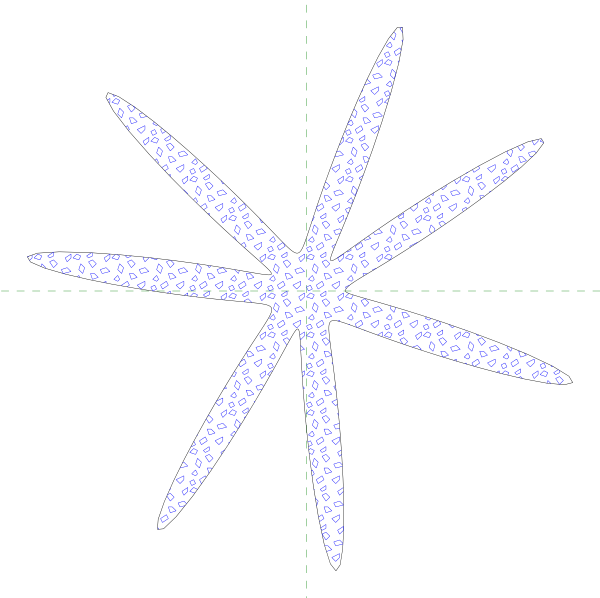

# dashing - a library for autocad-style hatch patterns

License: permissive (zlib); see source files for additional details.

On my core i5, it runs at over 1 million dashes per second.



## API

`struct Point`:
    Has double-precision x and y coordinates.

`struct Segment`:
    A line segment defined by two endpoints.  Segments are used both to
    define the boundary of the region to hatch, and to express the
    coordinates of the individual dots and dashes in the resulting hatch.

`HatchPattern::FromFile(std::istream fi, double scale)`:
    Read an autocad-style hatch pattern file from an opened stream

`HatchPattern::FromFile(const char *filename, double scale)`:
    Read an autocad-style hatch pattern from the named file

`xyhatch(const HatchPattern&, It start, It end, Cb cb)`:
    Iterators start..end define a range of segments, which must define a
    set of closed contours.  For each dash or dot in the resulting hatch, Cb
    is called with the output segment.

`xyhatch(const HatchPattern&, const C &segments, Cb cb)`:
    The container C holds segments which must define a set of closed
    contours.  For each dash or dot in the resulting hatch, Cb is called
    with the output segment.

Other items in the header file are implementation details.

## Demo program

The demo program, which compiles to `dashing` with `make`, reads a dash
pattern file and a segment list file and produces a svg file on the output
which visualizes the result of the hatch operation.

A segment list file consists of a closed contour on each line specified as a series of x,y coordinates.  For instance, this segment list is a simple box:
```
-100 -100 100 -100 100 100 -100 100
```
The first point is `-100 -100`.

It accepts several commandline parameters:

    -b: Benchmark mode: print only the number of dashes that would have been
        generated

    -j: Apply a jitter to all coordinaes in the segment list file

    -s: scale the dash pattern file by a given factor
